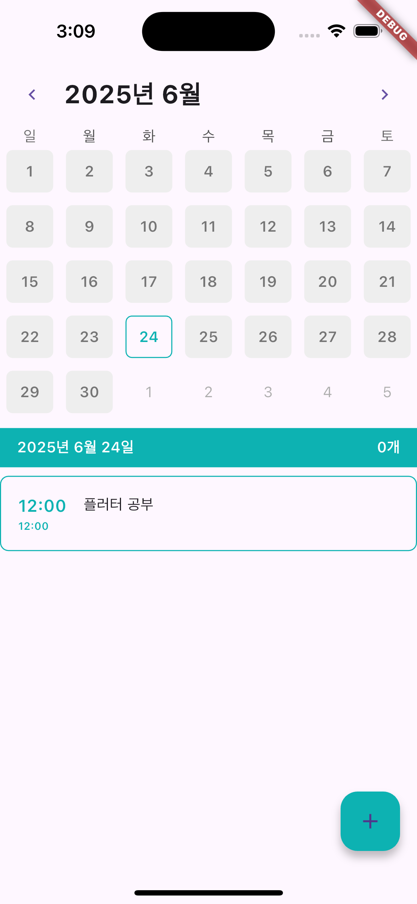

# 일정관리 앱 개인 프로젝트

## 🖼️ 메인화면 1차 구현

  
  

---

 

## 🛠️ 기능 설명

- 사용자는 달력에서 날짜를 선택할 수 있음
- + 버튼을 누르면 일정을 추가 하는 화면이 생김 → 모달창

---

 

## 🎯 2차 구현 목표

- UI 개선  
- 저장 버튼 활성화
